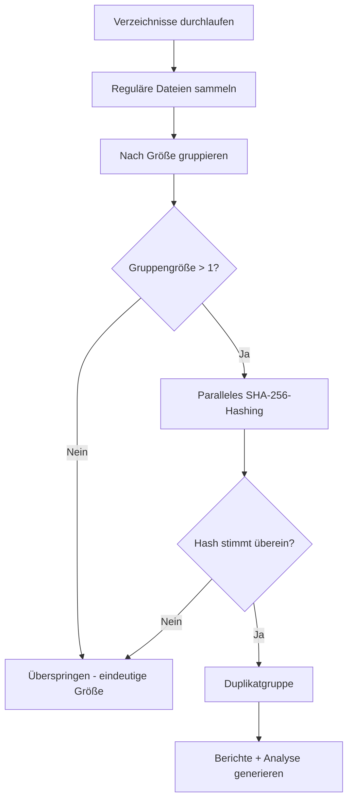

# find_dups: Mehrsprachiger Duplikat-Finder


Ein Hochleistungs-Duplikat-Finder, implementiert in **Go**, **Python**, **Rust**, **JavaScript** und **C++** mit identischen Algorithmen für faire Leistungsvergleiche und Produktionseinsatz.

## Überblick

`find_dups` scannt ein oder mehrere Verzeichnisse rekursiv, identifiziert doppelte Dateien mittels SHA-256-Hashing und erstellt Berichte, Dateityp-Analysen und Löschskripte.

### Hauptfunktionen

- **Mehrsprachige Implementierung**: Go-, Python-, Rust-, JavaScript- und C++-Versionen mit identischen Algorithmen
- **Parallele Verarbeitung**: Nutzt alle CPU-Kerne für schnelles Hashing
- **Echtzeit-Fortschrittsanzeigen**: Zeigt Dateianzahl und -größe während der Erfassung sowie Prozentsatz und geschätzte Restzeit beim Hashing (Aktualisierung alle 5 Sekunden)
- **Dateityp-Analyse**: Automatische Kategorisierung in 12 Kategorien mit JSON-Analyseausgabe
- **Sicherheit**: Erstellt ein Löschskript zur Überprüfung anstatt Dateien direkt zu löschen
- **Stiller Betrieb**: Unterdrückt Warnungen über Dateisystemberechtigungen während des Scans
- **Laufwerksübergreifend**: Scannt mehrere Verzeichnisse über verschiedene Mount-Punkte

## Anwendungsfälle

- **Backup-Konsolidierung**: Doppelte Dateien auf mehreren Backup-Laufwerken finden und entfernen vor der Archivierung
- **Speicherplatzrückgewinnung**: Platz freigeben durch Identifizierung redundanter Kopien großer Dateien (Firmware-Images, Dokumente, Medien)
- **Projektbereinigung**: Duplizierte Quelldateien, Bibliotheken oder Ressourcen zwischen eingebetteten Projekten erkennen
- **Migrationsüberprüfung**: Quell- und Zielverzeichnisse nach Datenmigration vergleichen zur Bestätigung, dass alle Dateien kopiert wurden
- **Laufwerksübergreifende Deduplizierung**: Dateien identifizieren, die zwischen interner SSD, externen Laufwerken und Netzwerkspeicher dupliziert sind

## Algorithmus

Alle fünf Implementierungen folgen demselben Algorithmus:



1. **Dateien sammeln** — Rekursiver Durchlauf aller angegebenen Verzeichnisse, Aufzeichnung von Pfad, Größe, Erstellungs- und Änderungszeit. Symlinks und Null-Byte-Dateien werden übersprungen.
2. **Nach Größe gruppieren** — Nur Dateien, die ihre Größe mit mindestens einer anderen Datei teilen, werden gehasht. Dateien mit eindeutiger Größe werden vollständig übersprungen.
3. **Paralleles SHA-256-Hashing** — Vollständiger SHA-256-Hash aller Kandidatendateien unter Verwendung aller CPU-Kerne.
4. **Ausgaben generieren**: CSV-Berichte, Löschskripte und JSON-Analyse.

### Parallele Verarbeitung

| Sprache   | Mechanismus                              |
|-----------|------------------------------------------|
| Go        | Goroutines mit Channel-basiertem Pool    |
| Python    | `multiprocessing.Pool`                   |
| Rust      | `rayon` paralleler Iterator              |
| JavaScript| `worker_threads` mit Worker-Pool         |
| C++       | `std::async` mit aufgeteilten Arbeitspaketen |

## Ausgabedateien

### duplicates_\<lang\>.csv
CSV-Datei mit allen nach Inhalt gruppierten Duplikatdateien:
| Spalte               | Beschreibung                          |
|----------------------|---------------------------------------|
| `FileID`             | Fortlaufende Dateikennung             |
| `Path`               | Vollständiger Dateipfad               |
| `Size`               | Dateigröße in Bytes                   |
| `Hash`               | SHA-256-Hash (hexadezimal)            |
| `CreationTime`       | Dateierstellungszeitstempel (ISO 8601)|
| `ModificationTime`   | Dateiänderungszeitstempel (ISO 8601)  |

### sort_dup_\<lang\>.csv
Alle gescannten Dateien, nach Größe sortiert (absteigend). Gleiche Spalten wie oben.

### analytics_\<lang\>.json
Dateityp-Analyse mit Erweiterungskategorisierung:
```json
{
  "summary": { "total_files": 148819, "duplicate_files": 696, "recoverable_bytes": 654000000 },
  "by_category": { "source": { "count": 52000, "duplicate_count": 320 } },
  "by_extension": { ".pdf": { "count": 1489, "duplicate_count": 15 } },
  "size_distribution": { "under_1kb": 12000, "1kb_100kb": 80000, "1mb_100mb": 10000 }
}
```

### duprm_\<lang\>.sh
Ausführbares Bash-Skript, das Duplikatdateien entfernt und die erste Datei (niedrigste FileID) in jeder Duplikatgruppe behält. **Überprüfen Sie dieses Skript vor der Ausführung.**

## Installation & Verwendung

### Go

```bash
cd find_dups_go
go build -o find_dups find_dups.go
./find_dups /pfad/scan1 /pfad/scan2 ...
```
Abhängigkeiten: Nur Standardbibliothek

### Python

```bash
python3 find_dups_pthon/find_dups.py /pfad/scan1 /pfad/scan2 ...
```
Voraussetzungen: Python 3.8+. Abhängigkeiten: Nur Standardbibliothek

### Rust

```bash
cd find_dups_rust
cargo build --release
./target/release/find_dups /pfad/scan1 /pfad/scan2 ...
```
Abhängigkeiten: `walkdir`, `sha2`, `csv`, `chrono`, `rayon`, `serde`, `serde_json`

### JavaScript (Node.js)

```bash
node find_dups_js/find_dups.js /pfad/scan1 /pfad/scan2 ...
```
Voraussetzungen: Node.js 16+. Abhängigkeiten: Nur Standardbibliothek

### C++

```bash
cd find_dups_cp
g++ -std=c++17 -O3 -pthread -I/usr/local/opt/openssl/include -L/usr/local/opt/openssl/lib \
    find_dups.cpp -o find_dups_cpp -lcrypto
./find_dups_cpp /pfad/scan1 /pfad/scan2 ...
```
Abhängigkeiten: OpenSSL (EVP API für SHA-256)

## Benchmark-Ergebnisse

Getestet mit ~149.000 Dateien in zwei Verzeichnissen (lokale SSD + externes USB-Laufwerk, 12 CPU-Kerne):

| Metrik                | Rust     | C++      | Python   | Go       | JavaScript |
|-----------------------|----------|----------|----------|----------|------------|
| Dateien gescannt      | 148.706  | 148.707  | 148.706  | 148.707  | 148.707    |
| Duplikate gefunden    | 585      | 585      | 585      | 585      | 585        |
| Gesamtzeit            | ~3:58    | ~4:17    | ~4:39    | ~5:01    | ~5:53      |
| Ausgabesuffix         | _rs      | _cpp     | _py      | _go      | _js        |

**Hinweise:**
- Alle Implementierungen liefern identische Ergebnisse (585 Duplikatgruppen)
- Null-Byte-Dateien werden übersprungen (112 falsch-positive „Duplikate" eliminiert)
- Rust und C++ führen bei der Leistung; alle Implementierungen nutzen parallele Verarbeitung

## Dateityp-Kategorien

Die Analyse kategorisiert Dateien nach Erweiterung in 12 Kategorien:

| Kategorie | Beispiele                              |
|-----------|----------------------------------------|
| source    | .c, .h, .cpp, .py, .js, .rs, .go      |
| firmware  | .hex, .bin, .elf, .dfu, .flash, .map  |
| ide       | .uvprojx, .ewp, .cproject, .ioc       |
| config    | .yaml, .cmake, .json, .toml, .xml     |
| docs      | .pdf, .md, .txt, .html, .doc, .docx   |
| image     | .png, .jpg, .jpeg, .svg, .tiff        |
| binary    | .exe, .dll, .so, .dylib, .o, .a       |
| archive   | .zip, .7z, .tar, .gz, .rar            |
| media     | .mp4, .wav, .avi, .mp3, .flac         |
| font      | .ttf, .otf, .woff, .woff2             |
| data      | .csv, .dts, .dtsi, .ld, .icf          |
| other     | (jede Erweiterung nicht in den obigen Kategorien) |

## Empfehlungen

### Welche Implementierung verwenden?

- **Schnellste insgesamt**: Rust — beste Leistung mit sicherer Parallelität
- **Beste einzelne Binärdatei**: Go — keine Abhängigkeiten, portable Binärdatei
- **Am einfachsten zu ändern**: Python — schnelles Prototyping, keine Kompilierung
- **Hohe Leistung**: C++ — schnell, erfordert OpenSSL
- **Node.js-Umgebungen**: JavaScript — integriert in JS/TS-Tooling

## Projektstruktur

```
find_dups/
├── README.md
├── compar.sh              # Benchmark-Runner
├── find_dups_go/          # Go-Implementierung
│   └── find_dups.go
├── find_dups_rust/        # Rust-Implementierung
│   ├── Cargo.toml
│   ├── src/main.rs
│   └── target/            # Build-Ausgabe (gitignore)
├── find_dups_cp/          # C++-Implementierung
│   └── find_dups.cpp
├── find_dups_js/          # JavaScript-Implementierung
│   └── find_dups.js
└── find_dups_pthon/       # Python-Implementierung
    └── find_dups.py
```

## Lizenz

Dieses Projekt wird wie besehen für Bildungszwecke und praktische Nutzung bereitgestellt.
