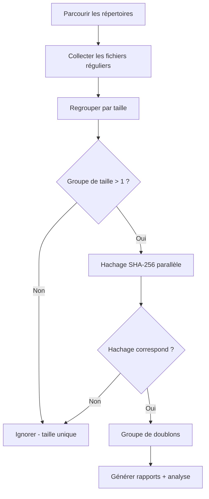

# find_dups : Détecteur de doublons multi-langages


Un détecteur de doublons haute performance implémenté en **Go**, **Python**, **Rust**, **JavaScript** et **C++** avec des algorithmes identiques pour une comparaison équitable des performances et une utilisation en production.

## Aperçu

`find_dups` analyse récursivement un ou plusieurs répertoires, identifie les fichiers en double via le hachage SHA-256 et génère des rapports, une analyse des types de fichiers et des scripts de suppression.

### Fonctionnalités clés

- **Implémentation multi-langage** : versions Go, Python, Rust, JavaScript et C++ avec des algorithmes identiques
- **Traitement parallèle** : utilise tous les cœurs CPU pour un hachage rapide
- **Indicateurs de progression en temps réel** : affiche le nombre et la taille des fichiers lors de la collecte, ainsi que le pourcentage et l'ETA lors du hachage (mise à jour toutes les 5 secondes)
- **Analyse des types de fichiers** : catégorisation automatique en 12 catégories avec sortie d'analyse JSON
- **Sécurité** : génère un script de suppression pour vérification au lieu de supprimer directement les fichiers
- **Support multi-disques** : scanne plusieurs répertoires sur différents points de montage

## Cas d'utilisation

- **Consolidation de sauvegardes** : Trouver et supprimer les fichiers en double sur plusieurs disques de sauvegarde avant archivage
- **Récupération d'espace disque** : Libérer de l'espace en identifiant les copies redondantes de fichiers volumineux (images firmware, documents, médias)
- **Nettoyage de projets** : Détecter les fichiers source, bibliothèques ou ressources dupliqués entre les projets embarqués
- **Vérification de migration** : Comparer les répertoires source et destination après une migration de données pour confirmer la copie de tous les fichiers
- **Déduplication inter-disques** : Identifier les fichiers dupliqués entre le SSD interne, les disques externes et le stockage réseau

## Algorithme

Les cinq implémentations suivent le même algorithme :



1. **Collecte des fichiers** — Parcours récursif de tous les répertoires spécifiés, enregistrement du chemin, de la taille, de la date de création et de modification. Les liens symboliques et les fichiers de zéro octet sont ignorés.
2. **Regroupement par taille** — Seuls les fichiers partageant une taille avec au moins un autre fichier sont hachés. Les fichiers de taille unique sont entièrement ignorés.
3. **Hachage SHA-256 parallèle** — Hachage SHA-256 complet de tous les fichiers candidats utilisant tous les cœurs CPU.
4. **Génération des sorties** : Rapports CSV, scripts de suppression et analyse JSON.

### Traitement parallèle

| Langage    | Mécanisme                                    |
|------------|----------------------------------------------|
| Go         | Goroutines avec pool basé sur des canaux     |
| Python     | `multiprocessing.Pool`                       |
| Rust       | Itérateur parallèle `rayon`                  |
| JavaScript | `worker_threads` avec pool de workers        |
| C++        | `std::async` avec charges de travail divisées|

## Fichiers de sortie

### duplicates_\<lang\>.csv
Fichier CSV contenant tous les fichiers en double groupés par contenu :
| Colonne              | Description                              |
|----------------------|------------------------------------------|
| `FileID`             | Identifiant séquentiel du fichier        |
| `Path`               | Chemin complet du fichier                |
| `Size`               | Taille du fichier en octets              |
| `Hash`               | Hachage SHA-256 (hexadécimal)            |
| `CreationTime`       | Horodatage de création du fichier (ISO 8601) |
| `ModificationTime`   | Horodatage de modification du fichier (ISO 8601) |

### sort_dup_\<lang\>.csv
Tous les fichiers scannés, triés par taille (décroissant). Mêmes colonnes que ci-dessus.

### analytics_\<lang\>.json
Analyse des types de fichiers avec catégorisation par extension :
```json
{
  "summary": { "total_files": 148819, "duplicate_files": 696, "recoverable_bytes": 654000000 },
  "by_category": { "source": { "count": 52000, "duplicate_count": 320 } },
  "by_extension": { ".pdf": { "count": 1489, "duplicate_count": 15 } },
  "size_distribution": { "under_1kb": 12000, "1kb_100kb": 80000, "1mb_100mb": 10000 }
}
```

### duprm_\<lang\>.sh
Script bash exécutable qui supprime les fichiers en double, en conservant le premier fichier (FileID le plus bas) dans chaque groupe de doublons. **Vérifiez ce script avant l'exécution.**

## Installation & Utilisation

### Go

```bash
cd find_dups_go
go build -o find_dups find_dups.go
./find_dups /chemin/scan1 /chemin/scan2 ...
```
Dépendances : Bibliothèque standard uniquement

### Python

```bash
python3 find_dups_pthon/find_dups.py /chemin/scan1 /chemin/scan2 ...
```
Prérequis : Python 3.8+. Dépendances : Bibliothèque standard uniquement

### Rust

```bash
cd find_dups_rust
cargo build --release
./target/release/find_dups /chemin/scan1 /chemin/scan2 ...
```
Dépendances : `walkdir`, `sha2`, `csv`, `chrono`, `rayon`, `serde`, `serde_json`

### JavaScript (Node.js)

```bash
node find_dups_js/find_dups.js /chemin/scan1 /chemin/scan2 ...
```
Prérequis : Node.js 16+. Dépendances : Bibliothèque standard uniquement

### C++

```bash
cd find_dups_cp
g++ -std=c++17 -O3 -pthread -I/usr/local/opt/openssl/include -L/usr/local/opt/openssl/lib \
    find_dups.cpp -o find_dups_cpp -lcrypto
./find_dups_cpp /chemin/scan1 /chemin/scan2 ...
```
Dépendances : OpenSSL (API EVP pour SHA-256)

## Résultats de benchmark

Testé sur ~149 000 fichiers dans deux répertoires (SSD local + disque USB externe, 12 cœurs CPU) :

| Métrique                | Rust     | C++      | Python   | Go       | JavaScript |
|-------------------------|----------|----------|----------|----------|------------|
| Fichiers scannés        | 148 706  | 148 707  | 148 706  | 148 707  | 148 707    |
| Doublons trouvés        | 585      | 585      | 585      | 585      | 585        |
| Temps total             | ~3:58    | ~4:17    | ~4:39    | ~5:01    | ~5:53      |
| Suffixe de sortie       | _rs      | _cpp     | _py      | _go      | _js        |

**Notes :**
- Toutes les implémentations produisent des résultats identiques (585 groupes de doublons)
- Les fichiers de zéro octet sont ignorés (112 faux positifs « doublons » éliminés)
- Rust et C++ sont les plus performants ; toutes les implémentations utilisent le traitement parallèle

## Catégories de types de fichiers

L'analyse catégorise les fichiers par extension en 12 catégories :

| Catégorie | Exemples                                |
|-----------|-----------------------------------------|
| source    | .c, .h, .cpp, .py, .js, .rs, .go       |
| firmware  | .hex, .bin, .elf, .dfu, .flash, .map   |
| ide       | .uvprojx, .ewp, .cproject, .ioc        |
| config    | .yaml, .cmake, .json, .toml, .xml      |
| docs      | .pdf, .md, .txt, .html, .doc, .docx    |
| image     | .png, .jpg, .jpeg, .svg, .tiff         |
| binary    | .exe, .dll, .so, .dylib, .o, .a        |
| archive   | .zip, .7z, .tar, .gz, .rar             |
| media     | .mp4, .wav, .avi, .mp3, .flac          |
| font      | .ttf, .otf, .woff, .woff2              |
| data      | .csv, .dts, .dtsi, .ld, .icf           |
| other     | (toute extension non listée ci-dessus)  |

## Recommandations

### Quelle implémentation utiliser ?

- **La plus rapide** : Rust — meilleures performances avec une concurrence sûre
- **Meilleur binaire unique** : Go — sans dépendances, binaire portable
- **La plus facile à modifier** : Python — prototypage rapide, sans compilation
- **Haute performance** : C++ — rapide, nécessite OpenSSL
- **Environnements Node.js** : JavaScript — s'intègre aux outils JS/TS

## Structure du projet

```
find_dups/
├── README.md
├── compar.sh              # Exécuteur de benchmark
├── find_dups_go/          # Implémentation Go
│   └── find_dups.go
├── find_dups_rust/        # Implémentation Rust
│   ├── Cargo.toml
│   ├── src/main.rs
│   └── target/            # Sortie de build (gitignore)
├── find_dups_cp/          # Implémentation C++
│   └── find_dups.cpp
├── find_dups_js/          # Implémentation JavaScript
│   └── find_dups.js
└── find_dups_pthon/       # Implémentation Python
    └── find_dups.py
```

## Licence

Ce projet est fourni tel quel pour un usage éducatif et pratique.
