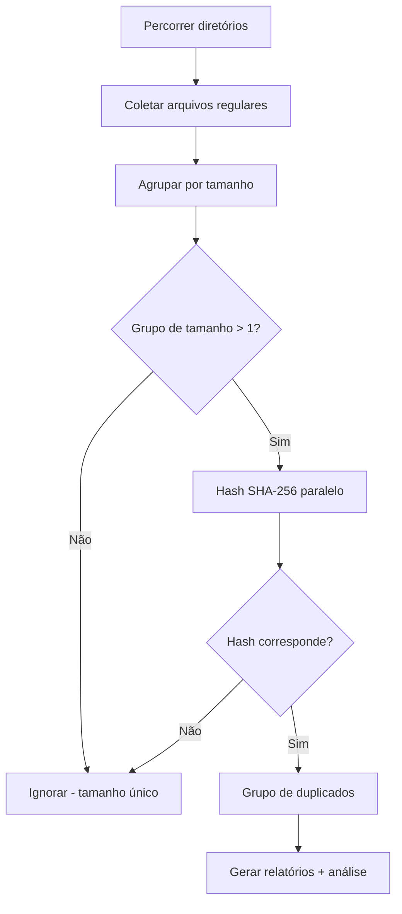

# find_dups: Buscador de Duplicados Multi-idioma


Um buscador de duplicados de alto desempenho implementado em **Go**, **Python**, **Rust**, **JavaScript** e **C++** com algoritmos idênticos para comparação justa de desempenho e uso em produção.

## Visão Geral

`find_dups` escaneia recursivamente um ou mais diretórios, identifica arquivos duplicados usando hash SHA-256 e gera relatórios, análise de tipos de arquivos e scripts de exclusão.

### Recursos Principais

- **Implementação multi-idioma**: versões em Go, Python, Rust, JavaScript e C++ com algoritmos idênticos
- **Processamento paralelo**: utiliza todos os núcleos da CPU para hash rápido
- **Indicadores de progresso em tempo real**: mostra quantidade e tamanho dos arquivos durante a coleta, bem como porcentagem e ETA durante o hash (atualização a cada 5 segundos)
- **Análise de tipos de arquivos**: categorização automática em 12 categorias com saída de análise JSON
- **Segurança**: gera um script de exclusão para revisão em vez de excluir arquivos diretamente
- **Operação silenciosa**: suprime avisos de permissões do sistema de arquivos durante a varredura
- **Suporte multi-drive**: escaneia múltiplos diretórios em diferentes pontos de montagem

## Casos de Uso

- **Consolidação de backups**: Encontrar e remover arquivos duplicados em múltiplos discos de backup antes do arquivamento
- **Recuperação de espaço em disco**: Recuperar espaço identificando cópias redundantes de arquivos grandes (imagens de firmware, documentos, mídia)
- **Limpeza de projetos**: Detectar arquivos fonte, bibliotecas ou recursos duplicados entre projetos embarcados
- **Verificação de migração**: Comparar diretórios de origem e destino após a migração de dados para confirmar que todos os arquivos foram copiados
- **Deduplicação entre drives**: Identificar arquivos duplicados entre SSD interno, drives externos e armazenamento de rede

## Algoritmo

Todas as cinco implementações seguem o mesmo algoritmo:



1. **Coletar arquivos** — Caminhada recursiva por todos os diretórios especificados, registrando caminho, tamanho, data de criação e modificação. Links simbólicos e arquivos de zero bytes são ignorados.
2. **Agrupar por tamanho** — Apenas arquivos que compartilham um tamanho com pelo menos um outro arquivo são hasheados. Arquivos com tamanho único são completamente ignorados.
3. **Hash SHA-256 paralelo** — Hash SHA-256 completo de todos os arquivos candidatos usando todos os núcleos da CPU.
4. **Gerar saídas**: Relatórios CSV, scripts de exclusão e análise JSON.

### Processamento Paralelo

| Linguagem  | Mecanismo                                  |
|------------|--------------------------------------------|
| Go         | Goroutines com pool baseado em canais      |
| Python     | `multiprocessing.Pool`                     |
| Rust       | Iterador paralelo `rayon`                  |
| JavaScript | `worker_threads` com pool de workers       |
| C++        | `std::async` com cargas de trabalho divididas|

## Arquivos de Saída

### duplicates_\<lang\>.csv
Arquivo CSV contendo todos os arquivos duplicados agrupados por conteúdo:
| Coluna               | Descrição                              |
|----------------------|----------------------------------------|
| `FileID`             | Identificador sequencial do arquivo    |
| `Path`               | Caminho completo do arquivo            |
| `Size`               | Tamanho do arquivo em bytes            |
| `Hash`               | Hash SHA-256 (hexadecimal)             |
| `CreationTime`       | Timestamp de criação do arquivo (ISO 8601) |
| `ModificationTime`   | Timestamp de modificação do arquivo (ISO 8601) |

### sort_dup_\<lang\>.csv
Todos os arquivos escaneados, ordenados por tamanho (decrescente). Mesmas colunas acima.

### analytics_\<lang\>.json
Análise de tipos de arquivos com categorização por extensão:
```json
{
  "summary": { "total_files": 148819, "duplicate_files": 696, "recoverable_bytes": 654000000 },
  "by_category": { "source": { "count": 52000, "duplicate_count": 320 } },
  "by_extension": { ".pdf": { "count": 1489, "duplicate_count": 15 } },
  "size_distribution": { "under_1kb": 12000, "1kb_100kb": 80000, "1mb_100mb": 10000 }
}
```

### duprm_\<lang\>.sh
Script bash executável que remove arquivos duplicados, preservando o primeiro arquivo (menor FileID) em cada grupo de duplicatas. **Revise este script antes de executar.**

## Instalação & Uso

### Go

```bash
cd find_dups_go
go build -o find_dups find_dups.go
./find_dups /caminho/scan1 /caminho/scan2 ...
```
Dependências: Apenas biblioteca padrão

### Python

```bash
python3 find_dups_pthon/find_dups.py /caminho/scan1 /caminho/scan2 ...
```
Pré-requisitos: Python 3.8+. Dependências: Apenas biblioteca padrão

### Rust

```bash
cd find_dups_rust
cargo build --release
./target/release/find_dups /caminho/scan1 /caminho/scan2 ...
```
Dependências: `walkdir`, `sha2`, `csv`, `chrono`, `rayon`, `serde`, `serde_json`

### JavaScript (Node.js)

```bash
node find_dups_js/find_dups.js /caminho/scan1 /caminho/scan2 ...
```
Pré-requisitos: Node.js 16+. Dependências: Apenas biblioteca padrão

### C++

```bash
cd find_dups_cp
g++ -std=c++17 -O3 -pthread -I/usr/local/opt/openssl/include -L/usr/local/opt/openssl/lib \
    find_dups.cpp -o find_dups_cpp -lcrypto
./find_dups_cpp /caminho/scan1 /caminho/scan2 ...
```
Dependências: OpenSSL (API EVP para SHA-256)

## Resultados de Benchmark

Testado em ~149.000 arquivos em dois diretórios (SSD local + drive USB externo, 12 núcleos de CPU):

| Métrica                | Rust     | C++      | Python   | Go       | JavaScript |
|------------------------|----------|----------|----------|----------|------------|
| Arquivos escaneados    | 148.706  | 148.707  | 148.706  | 148.707  | 148.707    |
| Duplicatas encontradas | 585      | 585      | 585      | 585      | 585        |
| Tempo total            | ~3:58    | ~4:17    | ~4:39    | ~5:01    | ~5:53      |
| Sufixo de saída        | _rs      | _cpp     | _py      | _go      | _js        |

**Notas:**
- Todas as implementações produzem resultados idênticos (585 grupos de duplicatas)
- Arquivos de zero bytes são ignorados (112 falsos positivos „duplicatas" eliminados)
- Rust e C++ lideram em desempenho; todas as implementações usam processamento paralelo

## Categorias de Tipos de Arquivos

A análise categoriza arquivos por extensão em 12 categorias:

| Categoria | Exemplos                                 |
|-----------|------------------------------------------|
| source    | .c, .h, .cpp, .py, .js, .rs, .go        |
| firmware  | .hex, .bin, .elf, .dfu, .flash, .map    |
| ide       | .uvprojx, .ewp, .cproject, .ioc         |
| config    | .yaml, .cmake, .json, .toml, .xml       |
| docs      | .pdf, .md, .txt, .html, .doc, .docx     |
| image     | .png, .jpg, .jpeg, .svg, .tiff          |
| binary    | .exe, .dll, .so, .dylib, .o, .a         |
| archive   | .zip, .7z, .tar, .gz, .rar              |
| media     | .mp4, .wav, .avi, .mp3, .flac           |
| font      | .ttf, .otf, .woff, .woff2               |
| data      | .csv, .dts, .dtsi, .ld, .icf            |
| other     | (qualquer extensão não listada acima)    |

## Recomendações

### Qual implementação usar?

- **Mais rápida**: Rust — melhor desempenho com concorrência segura
- **Melhor binário único**: Go — sem dependências, binário portátil
- **Mais fácil de modificar**: Python — prototipagem rápida, sem compilação
- **Alto desempenho**: C++ — rápido, requer OpenSSL
- **Ambientes Node.js**: JavaScript — integra com ferramentas JS/TS

## Estrutura do Projeto

```
find_dups/
├── README.md
├── compar.sh              # Executor de benchmark
├── find_dups_go/          # Implementação Go
│   └── find_dups.go
├── find_dups_rust/        # Implementação Rust
│   ├── Cargo.toml
│   ├── src/main.rs
│   └── target/            # Saída de build (gitignore)
├── find_dups_cp/          # Implementação C++
│   └── find_dups.cpp
├── find_dups_js/          # Implementação JavaScript
│   └── find_dups.js
└── find_dups_pthon/       # Implementação Python
    └── find_dups.py
```

## Licença

Este projeto é fornecido como está para uso educacional e prático.
