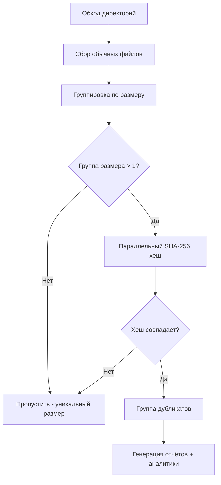

# find_dups: Многоязычный поиск дубликатов файлов


Высокопроизводительный поиск дубликатов файлов, реализованный на **Go**, **Python**, **Rust**, **JavaScript** и **C++** с идентичными алгоритмами для объективного сравнения производительности и производственного использования.

## Обзор

`find_dups` рекурсивно сканирует одну или несколько директорий, определяет дубликаты файлов с использованием хеширования SHA-256 и генерирует отчёты, аналитику типов файлов и скрипты удаления.

### Основные возможности

- **Многоязычная реализация**: версии на Go, Python, Rust, JavaScript и C++ с идентичными алгоритмами
- **Параллельная обработка**: использует все ядра процессора для быстрого хеширования
- **Индикаторы прогресса в реальном времени**: отображает количество файлов и размер при сборе, а также процент выполнения и ETA при хешировании (обновление каждые 5 секунд)
- **Аналитика типов файлов**: автоматическая категоризация в 12 категорий с выводом JSON-аналитики
- **Безопасность**: генерирует скрипт удаления для просмотра, а не удаляет файлы напрямую
- **Тихая работа**: подавляет предупреждения о разрешениях файловой системы во время сканирования
- **Поддержка нескольких дисков**: сканирует несколько директорий на разных точках монтирования

## Варианты применения

- **Консолидация резервных копий**: поиск и удаление дубликатов на нескольких备份-дисках перед архивированием
- **Освобождение дискового пространства**: возврат места путём выявления лишних копий больших файлов (прошивки, документы, медиа)
- **Очистка проектов**: обнаружение дублирующихся исходных файлов, библиотек или ресурсов между проектами
- **Проверка миграции**: сравнение исходной и целевой директорий после миграции данных для подтверждения копирования всех файлов
- **Междисковая дедупликация**: выявление файлов, дублированных между внутренним SSD, внешними дисками и сетевым хранилищем

## Алгоритм

Все пять реализаций следуют одному и тому же алгоритму:



1. **Сбор файлов** — рекурсивный обход всех указанных директорий, запись пути, размера, времени создания и модификации. Пропускаются символические ссылки и файлы нулевого размера.
2. **Группировка по размеру** — к хешированию допускаются только файлы, имеющие одинаковый размер хотя бы с одним другим файлом. Файлы с уникальным размером пропускаются полностью.
3. **Параллельный SHA-256 хеш** — полный SHA-256 хеш всех файлов-кандидатов с использованием всех ядер процессора.
4. **Генерация выходных данных**: CSV-отчёты, скрипты удаления и JSON-аналитика.

### Параллельная обработка

| Язык       | Механизм                                  |
|------------|-------------------------------------------|
| Go         | Горутины с пулом воркеров на каналах      |
| Python     | `multiprocessing.Pool`                    |
| Rust       | Параллельный итератор `rayon`             |
| JavaScript | `worker_threads` с пулом воркеров         |
| C++        | `std::async` с разбиением на части        |

## Выходные файлы

### duplicates_\<lang\>.csv
CSV-файл, содержащий все дубликаты файлов, сгруппированные по содержимому:
| Колонка             | Описание                             |
|---------------------|--------------------------------------|
| `FileID`            | Последовательный идентификатор файла |
| `Path`              | Полный путь к файлу                  |
| `Size`              | Размер файла в байтах                |
| `Hash`              | Хеш SHA-256 (шестнадцатеричный)      |
| `CreationTime`      | Время создания файла (ISO 8601)      |
| `ModificationTime`  | Время модификации файла (ISO 8601)   |

### sort_dup_\<lang\>.csv
Все просканированные файлы, отсортированные по размеру (по убыванию). Те же колонки.

### analytics_\<lang\>.json
Аналитика типов файлов с категоризацией по расширению:
```json
{
  "summary": { "total_files": 148819, "duplicate_files": 696, "recoverable_bytes": 654000000 },
  "by_category": { "source": { "count": 52000, "duplicate_count": 320 } },
  "by_extension": { ".pdf": { "count": 1489, "duplicate_count": 15 } },
  "size_distribution": { "under_1kb": 12000, "1kb_100kb": 80000, "1mb_100mb": 10000 }
}
```

### duprm_\<lang\>.sh
Исполняемый bash-скрипт, который удаляет дубликаты файлов, сохраняя первый файл (наименьший FileID) в каждой группе дубликатов. **Просмотрите этот скрипт перед выполнением.**

## Установка и использование

### Go

```bash
cd find_dups_go
go build -o find_dups find_dups.go
./find_dups /путь/к/сканированию1 /путь/к/сканированию2 ...
```
Зависимости: только стандартная библиотека

### Python

```bash
python3 find_dups_pthon/find_dups.py /путь/к/сканированию1 /путь/к/сканированию2 ...
```
Требования: Python 3.8+. Зависимости: только стандартная библиотека

### Rust

```bash
cd find_dups_rust
cargo build --release
./target/release/find_dups /путь/к/сканированию1 /путь/к/сканированию2 ...
```
Зависимости: `walkdir`, `sha2`, `csv`, `chrono`, `rayon`, `serde`, `serde_json`

### JavaScript (Node.js)

```bash
node find_dups_js/find_dups.js /путь/к/сканированию1 /путь/к/сканированию2 ...
```
Требования: Node.js 16+. Зависимости: только стандартная библиотека

### C++

```bash
cd find_dups_cp
g++ -std=c++17 -O3 -pthread -I/usr/local/opt/openssl/include -L/usr/local/opt/openssl/lib \
    find_dups.cpp -o find_dups_cpp -lcrypto
./find_dups_cpp /путь/к/сканированию1 /путь/к/сканированию2 ...
```
Зависимости: OpenSSL (EVP API для SHA-256)

## Результаты бенчмарков

Протестировано на ~149 000 файлах в двух директориях (локальный SSD + внешний USB-диск, 12 ядер CPU):

| Метрика                | Rust     | C++      | Python   | Go       | JavaScript |
|------------------------|----------|----------|----------|----------|------------|
| Просканировано файлов  | 148 706  | 148 707  | 148 706  | 148 707  | 148 707    |
| Найдено дубликатов     | 585      | 585      | 585      | 585      | 585        |
| Общее время            | ~3:58    | ~4:17    | ~4:39    | ~5:01    | ~5:53      |
| Суффикс выходных файлов| _rs      | _cpp     | _py      | _go      | _js        |

**Примечания:**
- Все реализации дают идентичные результаты (585 групп дубликатов)
- Файлы нулевого размера пропускаются (устранено 112 ложных «дубликатов»)
- Rust и C++ лидируют по производительности; все реализации используют параллельную обработку

## Категории типов файлов

Аналитика категоризирует файлы по расширению в 12 категорий:

| Категория | Примеры                                |
|-----------|----------------------------------------|
| source    | .c, .h, .cpp, .py, .js, .rs, .go      |
| firmware  | .hex, .bin, .elf, .dfu, .flash, .map  |
| ide       | .uvprojx, .ewp, .cproject, .ioc       |
| config    | .yaml, .cmake, .json, .toml, .xml     |
| docs      | .pdf, .md, .txt, .html, .doc, .docx   |
| image     | .png, .jpg, .jpeg, .svg, .tiff        |
| binary    | .exe, .dll, .so, .dylib, .o, .a       |
| archive   | .zip, .7z, .tar, .gz, .rar            |
| media     | .mp4, .wav, .avi, .mp3, .flac         |
| font      | .ttf, .otf, .woff, .woff2             |
| data      | .csv, .dts, .dtsi, .ld, .icf          |
| other     | (любое расширение не из списка выше)   |

## Рекомендации

### Какую реализацию использовать?

- **Самая быстрая**: Rust — лучшая производительность с безопасной параллельностью
- **Лучший единый бинарный файл**: Go — нет зависимостей, переносимый бинарный файл
- **Проще всего модифицировать**: Python — быстрое прототипирование, без компиляции
- **Высокая производительность**: C++ — быстро, требует OpenSSL
- **Для окружений Node.js**: JavaScript — интеграция с JS/TS инструментами

## Структура проекта

```
find_dups/
├── README.md
├── compar.sh              # Запуск бенчмарков
├── find_dups_go/          # Реализация на Go
│   └── find_dups.go
├── find_dups_rust/        # Реализация на Rust
│   ├── Cargo.toml
│   ├── src/main.rs
│   └── target/            # Результат сборки (gitignore)
├── find_dups_cp/          # Реализация на C++
│   └── find_dups.cpp
├── find_dups_js/          # Реализация на JavaScript
│   └── find_dups.js
└── find_dups_pthon/       # Реализация на Python
    └── find_dups.py
```

## Лицензия

Этот проект предоставляется как есть для образовательных и практических целей.
