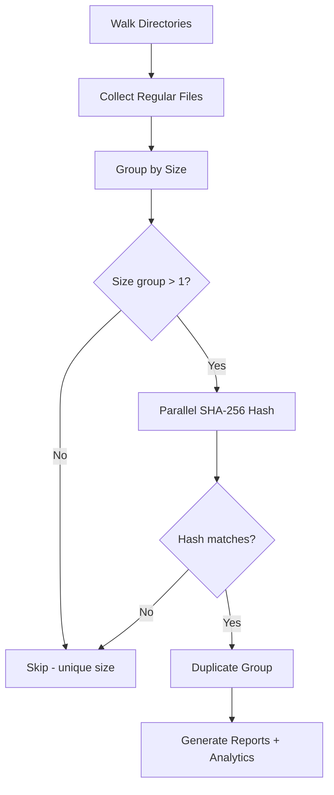

# find_dups: Cross-Language Duplicate File Finder


A high-performance duplicate file finder implemented in **Go**, **Python**, **Rust**, **JavaScript**, and **C++** with identical algorithms for performance comparison and production use.

## Overview

`find_dups` scans one or more directories recursively, identifies duplicate files using a multi-pass SHA-256 hashing strategy, and generates reports, analytics, and deletion scripts.

### Key Features

- **Multi-language implementation**: Go, Python, Rust, JavaScript, and C++ versions with identical algorithms
- **Multi-pass hashing**: Quick hash (first 4KB) → Full SHA-256 — skips hashing when files differ early
- **Parallel processing**: Utilizes all CPU cores for fast duplicate detection
- **File type analytics**: Automatic categorization and JSON analytics output
- **Safety**: Generates a deletion script for review rather than deleting files directly
- **Cross-drive support**: Scans multiple directories across different mount points

## Algorithm

All five implementations follow the same algorithm:



1. **Collect files** — Recursive walk through all specified directories, recording path, size, birth time, and modification time. Skips symlinks and zero-byte files.
2. **Group by size** — Only files sharing a size with at least one other file proceed to hashing.
3. **Parallel hash** — Full SHA-256 hash of all candidate files using all CPU cores.
4. **Generate outputs**: CSV reports, deletion scripts, and JSON analytics.

### Parallel Processing

| Language   | Mechanism                           |
|------------|-------------------------------------|
| Go         | Goroutines with channel-based pool  |
| Python     | `multiprocessing.Pool`              |
| Rust       | `rayon` parallel iterator           |
| JavaScript | `worker_threads` with Worker pool   |
| C++        | `std::thread` with `std::async`     |

## Output Files

### duplicates_\<lang\>.csv
CSV file containing all duplicate files grouped by content:
| Column            | Description                        |
|-------------------|------------------------------------|
| `FileID`          | Sequential file identifier         |
| `Path`            | Full file path                     |
| `Size`            | File size in bytes                 |
| `Hash`            | SHA-256 hash (hexadecimal)         |
| `CreationTime`    | File creation timestamp (ISO 8601) |
| `ModificationTime`| File modification timestamp (ISO 8601) |

### sort_dup_\<lang\>.csv
All scanned files sorted by size (descending). Same columns as above.

### analytics_\<lang\>.json
File type analytics with extension categorization:
```json
{
  "summary": { "total_files": 148819, "duplicate_files": 696, "recoverable_bytes": 654000000 },
  "by_category": { "source": { "count": 52000, "duplicate_count": 320 } },
  "by_extension": { ".pdf": { "count": 1489, "duplicate_count": 15 } },
  "size_distribution": { "under_1kb": 12000, "1kb_100kb": 80000, "1mb_100mb": 10000 }
}
```

### duprm_\<lang\>.sh
Executable bash script that removes duplicate files, preserving the first file (lowest FileID) in each duplicate group. **Review this script before executing.**

## Installation & Usage

### Go

```bash
cd find_dups_go
go build -o find_dups find_dups.go
./find_dups /path/to/scan1 /path/to/scan2 ...
```
Dependencies: Standard library only

### Python

```bash
python3 find_dups_pthon/find_dups.py /path/to/scan1 /path/to/scan2 ...
```
Prerequisites: Python 3.8+. Dependencies: Standard library only

### Rust

```bash
cd find_dups_rust
cargo build --release
./target/release/find_dups /path/to/scan1 /path/to/scan2 ...
```
Dependencies: `walkdir`, `sha2`, `csv`, `chrono`, `rayon`, `serde`, `serde_json`

### JavaScript (Node.js)

```bash
node find_dups_js/find_dups.js /path/to/scan1 /path/to/scan2 ...
```
Prerequisites: Node.js 16+. Dependencies: Standard library only

### C++

```bash
cd find_dups_cp
g++ -std=c++17 -O3 -pthread -I/usr/local/opt/openssl/include -L/usr/local/opt/openssl/lib \
    find_dups.cpp -o find_dups_cpp -lcrypto
./find_dups_cpp /path/to/scan1 /path/to/scan2 ...
```
Dependencies: OpenSSL (EVP API for SHA-256)

## Benchmark Results

Tested on ~149,000 files across two directories (local SSD + external USB drive, 12 CPU cores):

| Metric                | Rust     | C++      | Python   | Go       | JavaScript |
|-----------------------|----------|----------|----------|----------|------------|
| Files scanned         | 148,706  | 148,707  | 148,706  | 148,707  | 148,707    |
| Duplicates found      | 585      | 585      | 585      | 585      | 585        |
| Recoverable space     | —        | —        | —        | 345.8 MB | —          |
| Total time            | ~3:58    | ~4:17    | ~4:39    | ~5:01    | ~5:53      |
| Output suffix         | _rs      | _cpp     | _py      | _go      | _js        |

**Notes:**
- All implementations produce identical results (585 duplicate groups)
- Zero-byte files are skipped (112 false-positive "duplicates" eliminated vs. older versions)
- Rust and C++ lead performance; all implementations use parallel processing

## File Type Categories

Analytics categorize files by extension into:

| Category  | Examples                          |
|-----------|-----------------------------------|
| source    | .c, .h, .cpp, .py, .js, .rs, .go |
| firmware  | .hex, .bin, .elf, .dfu            |
| ide       | .uvprojx, .ewp, .cproject         |
| config    | .yaml, .cmake, .json, .toml       |
| docs      | .pdf, .md, .txt, .html            |
| image     | .png, .jpg, .svg                  |
| binary    | .exe, .dll, .so, .a               |
| archive   | .zip, .7z, .tar, .gz              |
| media     | .mp4, .wav, .mp3                  |
| font      | .ttf, .otf, .woff                 |
| data      | .csv, .xml, .dts                  |

## Recommendations

### Which implementation to use?

- **Fastest overall**: Rust (~3:58) — best performance with safe concurrency
- **Best single binary**: Go (~5:01) — no dependencies, portable binary
- **Easiest to modify**: Python (~4:39) — quick prototyping
- **High performance**: C++ (~4:17) — fast, requires OpenSSL
- **Node.js environments**: JavaScript (~5:53) — integrates with JS/TS tooling

## License

This project is provided as-is for educational and practical use.
