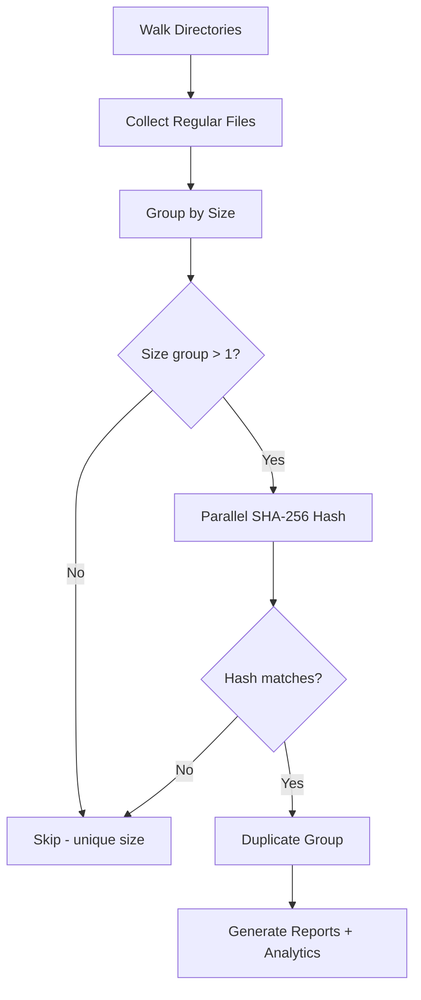

# find_dups: Cross-Language Duplicate File Finder


A high-performance duplicate file finder implemented in **Go**, **Python**, **Rust**, **JavaScript**, **Bun**, and **C++** with identical algorithms for fair performance comparison and production use.

## Overview

`find_dups` scans one or more directories recursively, identifies duplicate files using SHA-256 content hashing, and generates reports, file type analytics, and deletion scripts.

### Key Features

- **Multi-language implementation**: Go, Python, Rust, JavaScript, and C++ versions with identical algorithms
- **Parallel processing**: Utilizes all CPU cores for fast hashing
- **Real-time progress indicators**: Shows file count and size during collection, plus percentage and ETA during hashing (updates every 5 seconds)
- **File type analytics**: Automatic categorization into 12 categories with JSON analytics output
- **Safety**: Generates a deletion script for review rather than deleting files directly
- **Cross-drive support**: Scans multiple directories across different mount points

## Use Cases

- **Backup consolidation**: Find and remove duplicate files across multiple backup drives before archiving
- **Disk space recovery**: Reclaim space by identifying redundant copies of large files (firmware images, documents, media)
- **Project cleanup**: Detect duplicated source files, libraries, or assets across embedded projects and repositories
- **Migration verification**: Compare source and destination directories after data migration to confirm all files were copied
- **Cross-drive deduplication**: Identify files duplicated between internal SSD, external drives, and network storage

## Algorithm

All five implementations follow the same algorithm:



1. **Collect files** — Recursive walk through all specified directories, recording path, size, birth time, and modification time. Skips symlinks and zero-byte files.
2. **Group by size** — Only files sharing a size with at least one other file proceed to hashing. Files with unique sizes are skipped entirely.
3. **Parallel SHA-256 hash** — Full SHA-256 hash of all candidate files using all CPU cores.
4. **Generate outputs**: CSV reports, deletion scripts, and JSON analytics.

### Parallel Processing

| Language   | Mechanism                           |
|------------|-------------------------------------|
| Go         | Goroutines with channel-based pool  |
| Python     | `multiprocessing.Pool`              |
| Rust       | `rayon` parallel iterator           |
| JavaScript | `worker_threads` with Worker pool   |
| C++        | `std::async` with chunked workloads |

## Output Files

### duplicates_\<lang\>.csv
CSV file containing all duplicate files grouped by content:
| Column            | Description                        |
|-------------------|------------------------------------|
| `FileID`          | Sequential file identifier         |
| `Path`            | Full file path                     |
| `Size`            | File size in bytes                 |
| `Hash`            | SHA-256 hash (hexadecimal)         |
| `CreationTime`    | File creation timestamp (ISO 8601) |
| `ModificationTime`| File modification timestamp (ISO 8601) |

### sort_dup_\<lang\>.csv
All scanned files sorted by size (descending). Same columns as above.

### analytics_\<lang\>.json
File type analytics with extension categorization:
```json
{
  "summary": { "total_files": 148819, "duplicate_files": 696, "recoverable_bytes": 654000000 },
  "by_category": { "source": { "count": 52000, "duplicate_count": 320 } },
  "by_extension": { ".pdf": { "count": 1489, "duplicate_count": 15 } },
  "size_distribution": { "under_1kb": 12000, "1kb_100kb": 80000, "1mb_100mb": 10000 }
}
```

### duprm_\<lang\>.sh
Executable bash script that removes duplicate files, preserving the first file (lowest FileID) in each duplicate group. **Review this script before executing.**

## Installation & Usage

### Go

```bash
cd find_dups_go
go build -o find_dups find_dups.go
./find_dups /path/to/scan1 /path/to/scan2 ...
```
Dependencies: Standard library only

### Python

```bash
python3 find_dups_pthon/find_dups.py /path/to/scan1 /path/to/scan2 ...
```
Prerequisites: Python 3.8+. Dependencies: Standard library only

### Rust

```bash
cd find_dups_rust
cargo build --release
./target/release/find_dups /path/to/scan1 /path/to/scan2 ...
```
Dependencies: `walkdir`, `sha2`, `csv`, `chrono`, `rayon`, `serde`, `serde_json`

### JavaScript (Node.js)

```bash
node find_dups_js/find_dups.js /path/to/scan1 /path/to/scan2 ...
```
Prerequisites: Node.js 16+. Dependencies: Standard library only

### C++

```bash
cd find_dups_cp
g++ -std=c++17 -O3 -pthread -I/usr/local/opt/openssl/include -L/usr/local/opt/openssl/lib \
    find_dups.cpp -o find_dups_cpp -lcrypto
./find_dups_cpp /path/to/scan1 /path/to/scan2 ...
```
Dependencies: OpenSSL (EVP API for SHA-256)

## Benchmark Results

Tested on ~149,000 files across two directories (local SSD + external USB drive, 12 CPU cores):

| Metric                | Rust     | C++      | Python   | Go       | JavaScript |
|-----------------------|----------|----------|----------|----------|------------|
| Files scanned         | 148,706  | 148,707  | 148,706  | 148,707  | 148,707    |
| Duplicates found      | 585      | 585      | 585      | 585      | 585        |
| Total time            | ~3:58    | ~4:17    | ~4:39    | ~5:01    | ~5:53      |
| Output suffix         | _rs      | _cpp     | _py      | _go      | _js        |

**Notes:**
- All implementations produce identical results (585 duplicate groups)
- Zero-byte files are skipped (112 false-positive "duplicates" eliminated)
- Rust and C++ lead performance; all implementations use parallel processing


## Real-World Test Results (60 GB)

Tested on **77,313 files** (60 GB) across four directories in production environment:

| Metric          | **C++**  | **Go**   | **Rust** | **Python** | **JavaScript** |
|-----------------|----------|----------|----------|------------|----------------|
| Time            | **70.9s** | 72.7s    | 77.8s    | 82.1s      | 86.1s          |
| Duplicates      | 7,607    | 7,607    | 7,607    | 7,607      | 7,607          |
| Performance     | 🥇 **1st** | 🥈 2nd   | 🥉 3rd   | 4th        | 5th            |

**All implementations produce identical results** (77,313 files, 7,607 duplicates found).

**Key observations:**
- C++ demonstrates best performance (70.9s)
- All versions handle large datasets (60 GB) correctly
- Real-time progress indicators show file count and size during collection
- Silent operation: no filesystem permission warnings during scanning
## File Type Categories

Analytics categorize files by extension into 12 categories:

| Category  | Examples                              |
|-----------|---------------------------------------|
| source    | .c, .h, .cpp, .py, .js, .rs, .go     |
| firmware  | .hex, .bin, .elf, .dfu, .flash, .map |
| ide       | .uvprojx, .ewp, .cproject, .ioc      |
| config    | .yaml, .cmake, .json, .toml, .xml    |
| docs      | .pdf, .md, .txt, .html, .doc, .docx  |
| image     | .png, .jpg, .jpeg, .svg, .tiff       |
| binary    | .exe, .dll, .so, .dylib, .o, .a      |
| archive   | .zip, .7z, .tar, .gz, .rar           |
| media     | .mp4, .wav, .avi, .mp3, .flac        |
| font      | .ttf, .otf, .woff, .woff2            |
| data      | .csv, .dts, .dtsi, .ld, .icf         |
| other     | (any extension not in above categories) |

## Recommendations

### Which implementation to use?

- **Fastest overall**: Rust — best performance with safe concurrency
- **Best single binary**: Go — no dependencies, portable binary
- **Easiest to modify**: Python — quick prototyping, no compilation
- **High performance**: C++ — fast, requires OpenSSL
- **Node.js environments**: JavaScript — integrates with JS/TS tooling

## Project Structure

```
find_dups/
├── README.md
├── compar.sh              # Benchmark runner
├── find_dups_go/          # Go implementation
│   └── find_dups.go
├── find_dups_rust/        # Rust implementation
│   ├── Cargo.toml
│   ├── src/main.rs
│   └── target/            # Build output (gitignored)
├── find_dups_cp/          # C++ implementation
│   └── find_dups.cpp
├── find_dups_js/          # JavaScript implementation
│   └── find_dups.js
└── find_dups_pthon/       # Python implementation
    └── find_dups.py

```

## License

This project is provided as-is for educational and practical use.
